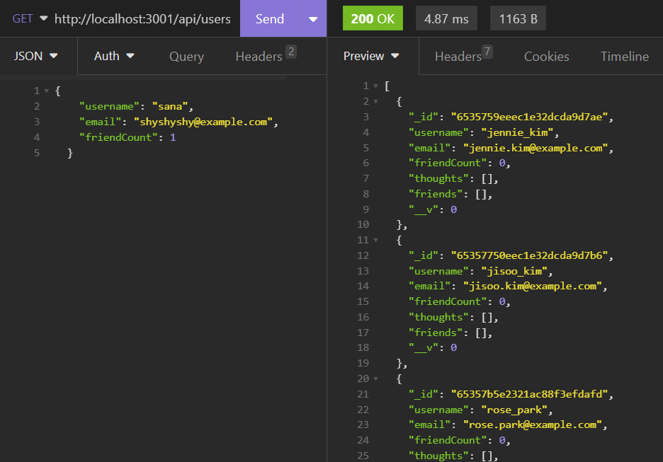

# Social Network API

## Description
This is a social network API built using Mongoose and MongoDB. It provides a back end for a social network where users can create and manage their thoughts.

## Getting Started
To run the application, follow these steps:

1. Ensure you have MongoDB installed on your machine.
2. Clone this repository.
3. Navigate to the project directory in your terminal.
4. Run the following command to install the required dependencies `npm install`
5. Start the application by running `npm run start`
6. Navigate to Insomnia to see the PUT, POST, PUT, and DELETE requests at work!

## Usage

### /api/users
- GET request sent to: /api/users will retrieve a list of all users in the database.
- GET request sent to: /api/users/:userId will retrieve information for a specific user based on their ID.
- POST request sent to: /api/users will create a new user by providing a username, email, and friendCount.
- PUT request sent to: /api/users/:userId will update an existing user's information.
- DELETE request sent to: /api/users/:userId will delete a user based on their ID. 

### /api/thoughts
- GET request sent to: /api/thoughts will retrieve a list of all thoughts registered to users in the database.
- GET request sent to: /api/thoughts/:thoughtId will retrieve information for a specific thought based on their ID.
- POST request sent to: /api/thoughts will create a new thought by providing a thoughtBody (string input), username of the user the thought is associated with, and the userID.
- PUT request sent to: /api/thoughts/:thoughtId will update an existing thought's information.
- DELETE request sent to: /api/thoughts/:thoughtId will delete a thought based on the thought ID. 

## Technologies
- Node.js
- Express.js
- Mongoose
- MongoDB
- Insomnia (for testing)

## License
n/a